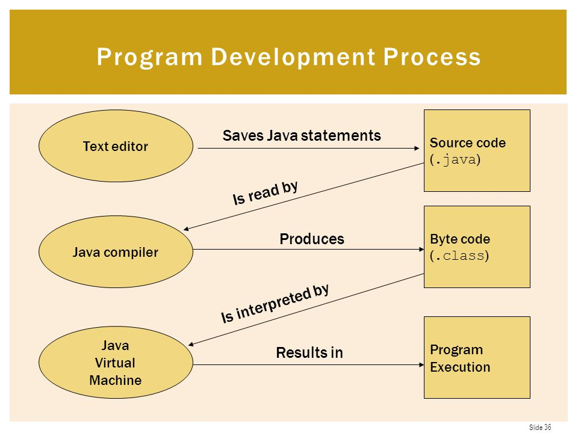

# JAVA Learning
This repository contains basic java codes, i would upload my daily learning codes and files in it.

## JAVA Program Execution Process

 

#### Very informative and detailed Youtube play-list for learning java in Bangla language: https://www.youtube.com/playlist?list=PLgH5QX0i9K3oAZUB2QXR-dZac0c9HNyRa

